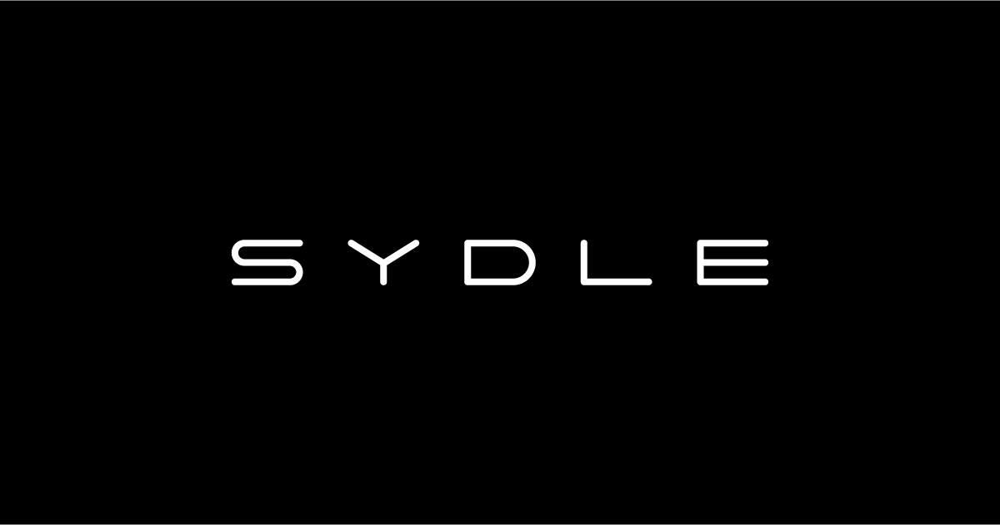

  

<h1 align="center">Universidade SYDLE</h1>
<h3 align="center">Trilha Foundations</h3>

### Descrição:
Este repositório contém as anotações e códigos desenvolvidos durante a trilha Foundations da Universidade SYDLE. O objetivo deste curso foi aprender os fundamentos do SYDLE ONE e como aplicá-los em projetos reais. As anotações foram divididas em 4 módulos, sendo eles:
- [Módulo 1: Introdução ao SYDLE ONE](./1-introduction/1-Index.md)
- [Módulo 2: ECM: Modelagem de Dados](./2-ECM/1-Index.md)
- [Módulo 3: BPM: Modelagem de Processos BPMN](./3-BPM/1-Index.md)
- [Módulo 4: Automação de APIs](./4-automacoes/1-%20Index.md)

### Tecnologias:
- SYDLE ONE
    - BPMN
    - ECM
- JavaScript
- Elasticsearch

### Pontos de melhoria:
Durante o curso, encontrei alguns links quebrados, todos podem ser observados no arquivo [Melhorias](./Melhorias.md). 